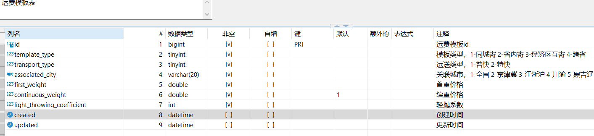
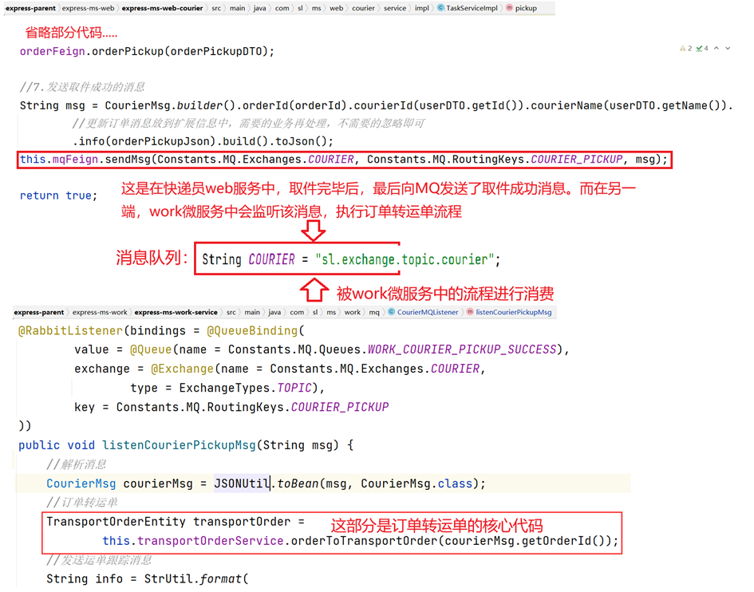
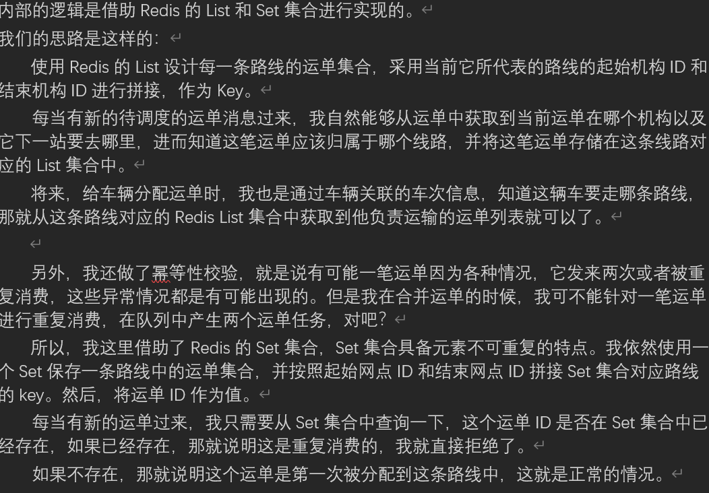

<p align="center">
	
</p>

# 明日达物流 


## 项目简介

物流项目体系包含四个端：管理后台、用户端、司机端以及快递员端

该项目是物流类的项目，它对标顺丰，京东，向C端用户提供快递服务的系统。主要分为四个端，分别是：用户端、快递员端、司机端和后台系统管理。用户在微信小程序下单后，会生成订单并创建揽件任务，快递员取件后，用户对订单进行支付，会产生交易单，而后创建运单。快件开始运输。经过 三级营业部、二级分拣中心、一级转运中心的运输流转，生成多个运输单。最终到达网点，快递员派件。用户签收或者拒收。

## 项目技术栈

项目中使用的技术：SpringBoot、SpringCloud 、mybatis、mybatisPlus、mysql、mongodb、Neo4j、ES、Redis、nacos、seata、gateway、openfeign、rabbitmq、xxl-job、nginx、jwt、OSS等。

整体框架采用springcloud+springboot的微服务框架采用前后台分离的方式进行的微服务开发，其中我们使用到的组件有alibaba的nacos作为我们的注册中心和配置中心，使用gateway作为我们的网关，服务间的远程调用我们采用openfeign，还会涉及到分布式事务问题，采用seata框架解决。

使用mybtais作为持久层框架，对于复杂的查询我们采用的是sql的形式，对于一些简单的增加更改操作我们使用的是MybatisPlus，简化开发，同时我们使用mysql作为主要数据库，mongodb用于物流信息存储。使用Redis作为我们的缓存数据库，实现物流信息的快速加载。Neo4j进行路线规划。

使用rabbitmq中间件来进行数据的传递、解耦，和削峰的处理。使用xxl-job作为我们分布式任务调度框架。使用nginx作为代理服务器。

## 项目展示


首页工作大屏


## 我的实习

说说你项目上的实习经历吧


### 限流模块

限流模块主要使用了 AOP、自定义注解、Lua脚本来实现的，主要是通过 在切面中定义切点位置，然后使用 前置通知来尽心限流，


## 我的职责

**责任描述：主要负责调度中心、路线管理、轨迹管理等功能模块的设计与开发**

### 1、双 Token 三验证

**用户端采用security + jwt 设计双Token（access_token、refresh_token）三验证的方案，实现Token的无感刷新。将Token存入Redis中，实现用户单点登录。**


>使用双 Token （access_token、refresh_token） 的 理由？
>
>- token 有效期设置过长，用户会频繁的登录。设置的过长，会不安全，一旦 token 被黑客截取的话，就可以使用此 token 与服务端进行交互了。因此，使用 refresh_token 为 access_token 续期。
>
>  1. 用户登录成功后，生成2个token，分别是 ： access_token、refresh_token，前者有效期短（5min）后者的有效期（24h）
>
>  2. 正常请求后端服务时，携带 access_token，如果发现 access_token失效，通过refresh_token 到后台服务中换取新的 access_token和 refresh_token
>
>- 另外，由于 token 是无状态的，服务端一旦颁发了token就无法让其失效（除非过了有效期），这样的话，如果我们检测到token异常也无法使其失效，所以这也是无状态token存在的问题。
>
>  1. 为了使后端可以控制其提前失效，将 refresh_token 设计成只能使用一次
>  2. 将 refresh_token 存储到 redis中，并且设置其过期时间
>  3. 检测到用户token 有安全隐患时，将 refresh_token 失效

### 2、运费模块

**负责用户下单后运费模块（==使用责任链模式选择不同运件收寄地的运费模板。编写相应的运费计算流程==）。**



说说用户下单流程

```
1、用户在微信小程序下单寄货，填写相应参数（发件方、收件方的地址ID、取件时间、取件方式、付款方式、物品类型、名称、数量、总体积、总重量、长宽高、备注等信息） ；
2、将请求发送给 前端 nginx 然后发送到网管，路由到 用户 web 服务中；
3、在用户web 服务中，判断用户参数（主要是收获件的地址），然后将这些信息发送给订单微服务
4、在订单微服务中，封装运费实体信息，包括（收获件地址），调用运费微服务计算好相应的运费。构建好相应的货物的信息。调用地图中台服务，计算好对应附近机构网点。然后将这笔订单保存到数据库中，最后发送消息 给 快递员 web 服务；
```

```java
运费是由运费模板进行定义的，不同的寄件收件城市，匹配的运费模板是不一样的
- 运费模板类型有：同城寄、省内寄、经济区互寄和跨省全国寄多种
一件快递，最终产生的运费，根据不同运费模板以及货物重量和体积进行计算的

在运费计算流程中，需要找到匹配的运费模板（对应的计算规则，才能进行最终运费的计算）
   public abstract class AbstractCarriageChainHandler {

    private AbstractCarriageChainHandler nextHandler;

    /**
     * 执行过滤方法，通过输入参数查找运费模板
     *
     * @param waybillDTO 输入参数
     * @return 运费模板
     */
    public abstract CarriageEntity doHandler(WaybillDTO waybillDTO);

    /**
     * 执行下一个处理器
     *
     * @param waybillDTO     输入参数
     * @param carriageEntity 上个handler处理得到的对象
     * @return
     */
    protected CarriageEntity doNextHandler(WaybillDTO waybillDTO, CarriageEntity carriageEntity) {
        if (nextHandler == null || carriageEntity != null) {
            //如果下游Handler为空 或 上个Handler已经找到运费模板就返回
            return carriageEntity;
        }
        return nextHandler.doHandler(waybillDTO);
    }

    /**
     * 设置下游Handler
     *
     * @param nextHandler 下游Handler
     */
    public void setNextHandler(AbstractCarriageChainHandler nextHandler) {
        this.nextHandler = nextHandler;
    }
} 

/**
 * 同城寄
 */
@Order(100) //定义顺序
@Component
public class SameCityChainHandler extends AbstractCarriageChainHandler {

    @Resource
    private CarriageService carriageService;

    @Override
    public CarriageEntity doHandler(WaybillDTO waybillDTO) {
        CarriageEntity carriageEntity = null;
        if (ObjectUtil.equals(waybillDTO.getReceiverCityId(), waybillDTO.getSenderCityId())) {
            //同城
            carriageEntity = this.carriageService.findByTemplateType(CarriageConstant.SAME_CITY);
        }
        return doNextHandler(waybillDTO, carriageEntity);
    }
}

@Component
public class CarriageChainHandler {

    /**
     * 利用Spring注入特性，按照 @Order 从小到达排序注入到集合中
     */
    @Resource
    private List<AbstractCarriageChainHandler> chainHandlers;

    private AbstractCarriageChainHandler firstHandler;

    /**
     * 组装处理链
     */
    @PostConstruct
    private void constructChain() {
        if (CollUtil.isEmpty(chainHandlers)) {
            throw new SLException("not found carriage chain handler!");
        }
        //处理链中第一个节点
        firstHandler = chainHandlers.get(0);
        for (int i = 0; i < chainHandlers.size(); i++) {
            if (i == chainHandlers.size() - 1) {
                //最后一个处理链节点
                chainHandlers.get(i).setNextHandler(null);
            } else {
                //设置下游节点
                chainHandlers.get(i).setNextHandler(chainHandlers.get(i + 1));
            }
        }
    }

    public CarriageEntity findCarriage(WaybillDTO waybillDTO) {
        //从第一个节点开始处理
        return firstHandler.doHandler(waybillDTO);
    }

}
```

怎样判断 寄件城市是否是经济区互寄？

```
先根据到寄件城市与收件城市所属城市 ，然后使用 hutool 工具类得到所有的经济区的枚举实例，然后循环遍历每个经济区实例，使用 hutool 工具类判断经济区实例是否包含了收件城市和寄件城市，包含则找到
```


运费计算流程

```
1、查找运费模板
用户将 参数（寄件地址、收件地址、货物重量体积）传入 快递员微服务中，根据 寄收件城市查询 计费模板（使用责任链模式进行匹配）并返回。运费模板中 保存了各种计费的项目，比如：首重价格多钱、续重价格多钱、轻抛系数，结合前端给到体积和重量。
2、计算重量
计算出货物的体积（cm^3），然后除以 运费模板中的 轻抛系数 得到 体积重量，在和前端传入的重量参数比对，哪个大，就按照 哪个 重量进行计费。
然后对 重量进行小数点处理：
- 小于一公斤，按照一公斤计算；
- 大于等于一公斤，小于十公斤，重量按照 0.1kg 四舍五入 保留1位小数（3.3 取 3.3 、3.6取 3.6）
- 大于等于 十公斤，小于一百公斤，重量按照 0.5 kg计算，四舍五入保留1位小数，18.1 取 18.5 ，18.6取19
- 大于一百公斤，直接四舍五入取整了，108.4kg 按照 108kg，108.5 取109
3、计算运费
根据运费计算公式： 运费 = 首重价格 + （实际重量 - 1） * 续重价格，计算出来运费以后，将运费模板、重量、价格这些信息封装为运费DTO实体类对象，返回给前端展示即可。
```


### 3、支付模块

**负责 交易中台部分模块开发，实现物流运单交易等操作。实现支付宝沙箱支付、微信支付等操作；使用工厂模式动态获取相应处理类，完成第三方支付平台的异步回调通知、使用定时任务主动轮询等获取支付结果等操作；**

交易流程时序图


```
首先设计之初，为了实现支付模块的 独立于其他微服务（对接其他服务），以此来达到无论哪个业务服务发起的支付的，只负责交易单的支付，依托与 RabbitMQ 解耦合其他微服务；无论是订单服务调用支付服务还是支付服务异步通知订单服务，都是通过 MQ 来进行服务间的通信的；

- 用户下单成功后，系统会为其分配快递员
- 快递员根据取件任务进行上门取件，与用户确认物品信息、重量、体积、运费等内容，确认无误后，取件成功
- 快递员会询问用户，使用支付宝还是微信付款，根据用户的选择，展现支付二维码
- 用户使用手机，打开支付宝或微信进行扫描操作，用户进行付款操作，最终会有支付成功或失败情况
```

整体扫码支付流程


>你是怎样对接微信和支付宝的呢 ？
>
>```
>1、注册支付宝和微信平台账号；
>2、引入 相关的sdk ；
>3、配置 应用私钥、支付宝公钥、AES 混淆加密到项目中；
>```
>
>对接支付宝的参数：配置在 支付渠道表里面
>
>```
>网关地址、应用ID、应用私钥、请求格式、字符串、签名类型、支付宝公钥、回调地址
>```
>
>怎样保证交易的安全？
>
>```
>在调用支付宝支付时，使用的 非对称加密算法 RSA2，通过我们自己的应用私钥进行签名，并且通过对称加密算法 AES 将请求参数也进行加密，加密后，将这两串密文进行拼接，调用sdk 里面创建支付二维码的api 传递给支付宝，然后支付宝使用我们应用公钥进行验签，并将请求参数进行解密。经过支付宝处理后；支付宝利用自己的私钥进行签名并使用AES加密将结果返回给我们的系统，我们的系统然后使用支付宝的公钥进行验签，并使用 AES 进行解密得到支付结果
>```
>
>
>
>说说订单创建流程？
>
>```
>用户下单：用户下单的时候，将快递信息（比如 重量、体积）等发送到订单微服务，生成订单
>快递员揽件：快递员进行揽件后，再次确认货物数据信息，然后在快递员端 将这笔订单转为运单；
>订单微服务：封装好订单 ID、基本信息、订单金额、支付方式、支付企业号、支付渠道等信息，然            后调用 支付微服务，创建交易单，将交易单信息保存在数据库中，发起第三方调用。
>
>```
>
>说说你的支付流程？（创建交易单的流程）
>
>创建交易单的流程涉及到 幂等性、分布式锁的处理，同时在获取支付方式的时候，涉及使用了工厂模式进行优化

支付流程

1、创建二维码链接

```
构造交易请求实体类，封装 好（交易单号、交易金额、支付主题）到map 中，然后调用 alipay sdk client客户端发起请求
如果出现异常，直接捕获就可以；最后获取请求结果，将这个结果 给 hutool 工具类生成二维码返回给前端即可
```

2、等待用户付款，这一部分我们不用管，交给三方平台做就好

3、进行付款查询

```
构造号交易请求实体类， 封装 好（交易单号）到map 中，然后调用 alipay sdk client客户端发起请求，查看交易是否为 trade_success 是否成功
```

4、如果用户退款

```
对于退款请求，我们的系统支持一笔交易多笔退款，只是说在多笔退款的时候，设置多笔不同的 退款请求号即可
同一笔退款至少间隔3s后发起

```

5、查询退款请求是否到账

### 4、运单合并

**使用 RabbitMQ 延时队列 完成订单转运单逻辑操作；调度中心模块使用 Redis List、Set 数据结构处理运单分发;**

==运单状态：== 新建、装车、运输中、到达终端网点、拒收




说说你的订单转运单的流程吧

```
快递员上门取件后，由快递员 微服务处理收件请求。取件完毕后，最后向 MQ 发送了取件成功的消息。在另一端，work 微服务中会监听该消息，执行订单转运单流程

在 work 微服务中，会消费这条消息。
1、首先会对这条消息进行幂等性的判断，根据订单ID 查询是否存在 相应的运单信息；存在抛出异常
2、然后判断 订单以及货物参数（重量体积）、货物位置信息是否异常；
3、根据传进来的订单实体信息，得到寄收件人的营业网点是否相同，判断其是否参与调度。
	3.1 如果参与调度，就需要通过 feign 接口调用路线规划服务，传入 寄收件人 ID ，查询路线规划
4 然后封装好运单信息，把一些重要参数，如 运单ID、订单ID、调度状态、运单状态，起始，终端营业网点等信息封装好
5、封装好了之后，将运单保存到数据库中，
6、根据运单是否参与调度状态做如下：
	不需要参与调度：1、向订单微服务发送延迟消息，更改订单的状态为已到达终端网点
				 2、向调度中心发送延迟消息，生成取派件任务
	需要调度，向调度中心发送一条延迟消息等待调度，处理订单完成合并运单操作
	
	最后，无论是否需要调度，都需要向运单延迟队列发送一条消息，消息的内容就是运单 ID 和 订单ID 。通知其他系统。运单已经生成
```

运单合并流程

```
运单合并流程中，就是将每一个机构等待调度的快件，进行分组。将当前机构的快件按照去往相同下一站的条件、进行分组。
每当有新的调度的运单消息过来，然后我们从运单中获取到当前运单的下一站去哪里，然后利用 redis list数据结构将这笔订单存储在 list 数据结构中。 将来的话，也是从对应的 Redis list集合中获取对应的负责的运输的运单列表即可

1、取出订单信息里面的起始网点和终点网点；
2、进行幂等性的判断；使用 isMember 判断是否在这个set集合中，在直接返回
3、然后分别存储到 redis 的 list 集合【leftpush】和 set 集合中

```



运单状态修改时的一个流程？

>司机微服务出库流程：司机运输流程中，当司机出入库以后，需要修改运单状态为运输中，开始运输任务；
>
>快递员 web 微服务快递拒收流程：快递员派件时，快递被用户拒收了，需要修改运单状态为拒收

```txt
订单状态改变由 work运单微服务负责，流程如下：
1、进行参数校验，判断 运单id 列表是否为空，修改的状态是否为新建状态，否则抛出异常
2、修改订单状态为 拒收的情况下：
	2.1、遍历每一个运单对象，将起始网点和终点网点进行互换
	2.2、如果不参与调度【起始网点和终点网点相同】
		2.2.1、修改运单状态为已到达状态，发送延迟消息给调度中心生成取件任务
	2.3、参与调度，查询回去的路线规划，修改运单为待调度，并删除当前节点后拼接返回的路线规划
	2.4、发送延迟消息给 调度中心进行一个运单的合并
3、如果不为拒收的情况：
	3.1、遍历这些运单对象列表，获取即将发往的目的地机构，构建消息实体类
	3.2、发送运单物流消息，保存在 MongoDB中；设置运单状态
4、进行一个数据库的批量更新
5、发送消息给订单微服务，更改订单状态；
	
```


```java
 /**
     * 修改运单状态
     *
     * @param ids                  运单id列表
     * @param transportOrderStatus 修改的状态
     * @return
     */
    @Override
    public boolean updateStatus(List<String> ids, TransportOrderStatus transportOrderStatus) {
        if (CollUtil.isEmpty(ids)) {
            return false;
        }

        if (TransportOrderStatus.CREATED == transportOrderStatus) {
            //修改订单状态不能为 新建 状态
            throw new SLException(WorkExceptionEnum.TRANSPORT_ORDER_STATUS_NOT_CREATED);
        }

        List<TransportOrderEntity> transportOrderList;
        //判断是否为拒收状态，如果是拒收需要重新查询路线，将包裹逆向回去
        if (TransportOrderStatus.REJECTED == transportOrderStatus) {
            //查询运单列表
            transportOrderList = super.listByIds(ids);
            for (TransportOrderEntity transportOrderEntity : transportOrderList) {
                //设置为拒收运单
                transportOrderEntity.setIsRejection(true);
                //根据起始机构规划运输路线，这里要将起点和终点互换
                Long sendAgentId = transportOrderEntity.getEndAgencyId();//起始网点id
                Long receiveAgentId = transportOrderEntity.getStartAgencyId();//终点网点id

                //默认参与调度
                boolean isDispatch = true;
                if (ObjectUtil.equal(sendAgentId, receiveAgentId)) {
                    //相同节点，无需调度，直接生成派件任务
                    isDispatch = false;
                } else {
                    TransportLineNodeDTO transportLineNodeDTO = this.transportLineFeign.queryPathByDispatchMethod(sendAgentId, receiveAgentId);
                    if (ObjectUtil.hasEmpty(transportLineNodeDTO, transportLineNodeDTO.getNodeList())) {
                        throw new SLException(WorkExceptionEnum.TRANSPORT_LINE_NOT_FOUND);
                    }

                    //删除掉第一个机构，逆向回去的第一个节点就是当前所在节点
                    transportLineNodeDTO.getNodeList().remove(0);
                    transportOrderEntity.setSchedulingStatus(TransportOrderSchedulingStatus.TO_BE_SCHEDULED);//调度状态：待调度
                    transportOrderEntity.setCurrentAgencyId(sendAgentId);//当前所在机构id
                    transportOrderEntity.setNextAgencyId(transportLineNodeDTO.getNodeList().get(0).getId());//下一个机构id

                    //获取到原有节点信息
                    TransportLineNodeDTO transportLineNode = JSONUtil.toBean(transportOrderEntity.getTransportLine(), TransportLineNodeDTO.class);
                    //将逆向节点追加到节点列表中
                    transportLineNode.getNodeList().addAll(transportLineNodeDTO.getNodeList());
                    //合并成本
                    transportLineNode.setCost(NumberUtil.add(transportLineNode.getCost(), transportLineNodeDTO.getCost()));
                    transportOrderEntity.setTransportLine(JSONUtil.toJsonStr(transportLineNode));//完整的运输路线
                }
                transportOrderEntity.setStatus(TransportOrderStatus.REJECTED);

                if (isDispatch) {
                    //发送消息参与调度
                    this.sendTransportOrderMsgToDispatch(transportOrderEntity);
                } else {
                    //不需要调度，发送消息生成派件任务
                    transportOrderEntity.setStatus(TransportOrderStatus.ARRIVED_END);
                    this.sendDispatchTaskMsgToDispatch(transportOrderEntity);
                }
            }
        } else {
            //根据id列表封装成运单对象列表
            transportOrderList = ids.stream().map(id -> {
                //获取将发往的目的地机构
                Long nextAgencyId = this.getById(id).getNextAgencyId();
                OrganDTO organDTO = organFeign.queryById(nextAgencyId);

                //构建消息实体类
                String info = CharSequenceUtil.format("快件发往【{}】", organDTO.getName());
                String transportInfoMsg = TransportInfoMsg.builder()
                        .transportOrderId(id)//运单id
                        .status("运送中")//消息状态
                        .info(info)//消息详情
                        .created(DateUtil.current())//创建时间
                        .build().toJson();
                //发送运单跟踪消息
                this.mqFeign.sendMsg(Constants.MQ.Exchanges.TRANSPORT_INFO, Constants.MQ.RoutingKeys.TRANSPORT_INFO_APPEND, transportInfoMsg);

                //封装运单对象
                TransportOrderEntity transportOrderEntity = new TransportOrderEntity();
                transportOrderEntity.setId(id);
                transportOrderEntity.setStatus(transportOrderStatus);
                return transportOrderEntity;
            }).collect(Collectors.toList());
        }

        //批量更新数据
        boolean result = super.updateBatchById(transportOrderList);

        //发消息通知其他系统运单状态的变化
        this.sendUpdateStatusMsg(ids, transportOrderStatus);

        return result;
    }

    private void sendUpdateStatusMsg(List<String> ids, TransportOrderStatus transportOrderStatus) {
        String msg = TransportOrderStatusMsg.builder()
                .idList(ids)
                .statusName(transportOrderStatus.name())
                .statusCode(transportOrderStatus.getCode())
                .build().toJson();

        //将状态名称写入到路由key中，方便消费方选择性的接收消息
        String routingKey = Constants.MQ.RoutingKeys.TRANSPORT_ORDER_UPDATE_STATUS_PREFIX + transportOrderStatus.name();
        this.mqFeign.sendMsg(Constants.MQ.Exchanges.TRANSPORT_ORDER_DELAYED, routingKey, msg, Constants.MQ.LOW_DELAY);
    }
```


### 5、运输任务生成流程

**设计使用 XXL-JOB 分布式任务调度实现定时自动分配运单生成运输任务，并使用分片广播任务调度策略，实现并行处理车辆安排，提升调度的处理效率。**

```
通过 xxl-job 定义了定时任务，采用了分片策略进行广播，每间隔5min执行一次 从redis 取出 运单，然后查询未来两个小时的发车的车次并进行运力计算，筛选出符合条件的 车次进行运输；
因为等待分配任务的车次可能有两三百个，但是如果我们把这两三百个分配车次任务的计算压力都给到一个调度微服务，那肯定是不合理的。我们在部署微服务的时候，调度微服务部署了多个实例，组成一个集群，我应该将计算压力平均分配到集群里面的每一个节点；
使用 xxl-job的分片广播，传入 xxl-job的分片数量和当前任务的下表，利用sql语法的mod 函数，用车次 ID对分片总数量取余，得到一部分的车次信息，返回给当前调度微服务，从而实现将多个车次任务分配给多个调度微服务去处理，这就是负载均衡的意思。
```

在我的项目中，是由 调度微服务负责整体的 调度流程，触发运输流程自然也是由调度微服务负责。在调度微服务，使用 XXL-JOB 实现了分布式任务调度功能，每间隔一段事件，就执行一次定时任务，定时任务的内容就是生成运输任务

整体流程：

等待分配任务的车次，可能有两三百个，但是如果把这两三百个分配车次任务的计算压力都给到一个调度微服务，那肯定不合理的，因此在部署微服务的时候，调度微服务部署了多个实例，使用 xxl-job 分片广播集群，将计算压力平均分配到集群里面的每一个实例。

```txt
1、通过 xxl-job 定义了定时任务。采用分片策略进行广播，为了使多个微服务实例并行处理车辆安排
2、调用基础微服务，查询未来两个小时内等待发车的车次信息，传入 xxl-job 的分片节点数量还有当前节点索引。
	在使用 Mp查询的时候，利用了 sql 中的 mod 函数，用车次 id 对分片总数量取余，得到一部分的车次信息，然后再返回给当前调度微服务。
3、更改车次计划状态为已分配；
4、为了 避免 并发问题，加上分布式锁，锁住 key（发车机构id和 结束机构id），按照加锁的顺序，业务顺序在前的肯定是有限执行的。
5、然后对车次分别进行 装载，从 redis list 集合取出运单分配到车次上，并进行递归处理操作，直到运单体积、重量超过车次最大承载量；并将最后一个运单 Rpush 进 redis list 队列；然后删除掉对应 redis list和set里面的数据
6、最后发送消息到mq 通知其他微服务生成 运输任务和 司机作业单；
```


### 6、物流追踪模块

**6、为了提高物流追踪模块的查询效率，使用MongoDB存储物流追踪信息。另外通过 Redis + Caffieine 实现多级缓存。通过Redis的消息订阅发布模型解决集群环境下一级缓存与Redis缓存不一致的问题。**

>我们的项目中有一个作业范围这个功能  作业范围：     使用到的技术是 MongoDB
>
>我们每一个营业网点都可以画一个作业范围在地图上，画好这个范围组成一个闭合的多边形，这个多边形是由多个坐标点组成的，然后利用 MongDB 把多个坐标点存储到 Mongo 数据库中，在 MongDB 中提供了根据多个作业范围内查询的一个方法（intersects）,查询的时候参数只需要传递一个坐标点，返回的就是和这个坐标点有交差的多边形对应的数据查询出来，这个多边形关联的就是我们的机构网点ID

文档持久类：【sl_service_scope】

| ObjectId       | 主键                                                   |      |
| -------------- | ------------------------------------------------------ | ---- |
| bid            | 业务id                                                 |      |
| type           | 作业范围类型【机构、快递员】                           |      |
| GeoJsonPolygon | 多边形范围，闭合的范围，开始经纬度与结束经纬度必须一样 |      |
| created        | 创建时间                                               |      |
| updated        | 更新时间                                               |      |

用户下单，需要设定每个快递员或机构的作业范围，而范围是一组经纬度数据。使用 关系型数据库 mysql 来存储和查找坐标数据范围麻烦以及很不合适，因此选择非关系型数据 es 或者 Mongo来实现，但是由于 es 偏向于存储搜索时适合做索引的数据，想要实现坐标范围的查询还是很麻烦的。MongoDB 这种非关系型数据库，适合存储数据量大的 信息，而且也提供了 空间索引这种数据结构来存储空间坐标，我们的作业范围是由多个坐标点组成的多边形。因此，使用 MongoDB 来存储网点、快递员的坐标位置信息更合适

```
对于作业范围是一个由多个坐标点组成的多边形，并且必须是闭合的多边形，这个就比较适合用MongoDB来存储。现在想一个实际需求，用户小王下了订单，如何找到属于该服务范围内的快递员呢？这个就需要使用MongoDB的$geoIntersects查询操作，其原理就是查找小王的位置坐标点与哪个多边形有交叉，这个就是为其服务的快递员。
```


```

MongoDB 存储的数据结构与 MySQL 存储的数据结构有什么区别 ？
MongoDB 存储的数据结构是 以 Bson 方式存储的 类似于 Json，而 MySQL 存储数据是以 行和列来存储的；

为什么使用 MongoDB？
因为在项目中有一个 作业范围的需求，作业范围会涉及到一个多边形的存储，这个多边形是由多个坐标点存储的，而 MongoDB 支持这种坐标类型的这个数据存储，并且用 MongoDB 存储之后还支持一种查询的语法，查给定的坐标点和我们的作业范围是不是有交集，把有交集的数据查出来用于匹配网点

你使用 MongoDB 如何实现附近的人的查询？
原理就是根据自己为 远点，绘制好半径，然后使用 MongoTemplate.geoNear 来查询这个半径内的所有坐标，最后转为 一个集合就可以了

用户下单后如何确定为其服务的快递员？确定起点终点的机构【怎样确认为其服务的起点或者终点的机构】？
就是说用户下完单之后有一个地址，根据 我们封装的一个 地图组件 ego map来查询出相应的坐标点；在我们的系统中，快递员和营业网点都对应一个坐标范围，【在后台中，为快递员或者营业网点设置作业范围】；当我确认下好订单之后，就可以查询 mongoDB 数据库里面，查询出满足有交集作业的快递员和营业网点。
```

==取件任务流程：==

用户在下单后，订单微服务会发消息出来，消息会在 dispatch 微服务中进行调度计算，最终会向 work 微服务发送消息，用于生成快递员的取件任务。


快递员取消取件任务的原因：【因为个人原因无法取件，需要退回到网点】，需要重新生成取件任务：


